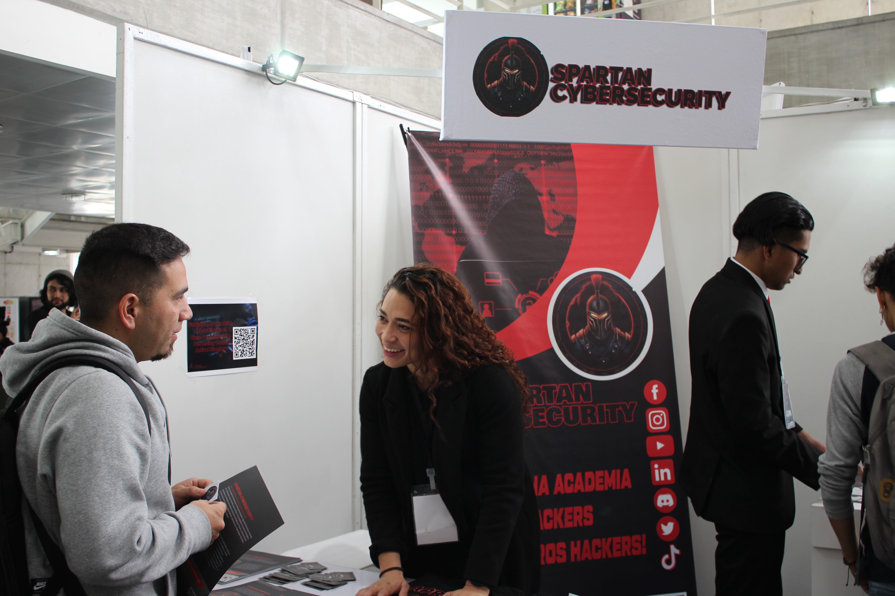

# Conoce a tu academia

## 💻 <mark style="color:red;">¿Quiénes Somos?</mark>

**Spartan-Cybersecurity** somos una academia, dedicada a forjar **especialistas en Ethical Hacking**. Nuestra misión es brindar una educación online de vanguardia en seguridad informática y hacking ético, diseñada para introducir a estudiantes en las tecnologías de punta y el arte del pentesting.

<figure><figcaption>
Evento de Ciberseguridad en la Universidad Nacional de Colombia
</figcaption></figure>

## 🎯 <mark style="color:red;">Nuestro Enfoque</mark>

Ofrecemos una experiencia de aprendizaje única mediante **laboratorios prácticos**, donde asumirás el rol de un consultor de ciberseguridad ofensiva. Tu desafío será comprometer múltiples objetivos, poniendo a prueba tus habilidades y conocimientos en situaciones reales.

Nuestro objetivo es que aprendas las técnicas utilizadas por hackers contemporáneos, disfrutando de un proceso educativo práctico y entretenido que te convierta en un **experto en ciberseguridad**.

## 📚 <mark style="color:red;">Cursos Actuales</mark>

Estamos orgullosos de ofrecer una amplia gama de certificaciones profesionales para aquellos que buscan especializarse en diferentes áreas del pentesting y la ciberseguridad:

* [**Certificado Profesional de Pentesting contra la Nube de AWS | \[CPNA\]**](https://www.spartan-cybersec.com/cursos/pentesting-contra-la-nube-de-aws/)
* [**Certificado Profesional de RedTeam OPS Developer Senior | \[RTOD-100\]**](https://www.spartan-cybersec.com/cursos/redteams-ops-developer/)
* [**Certificado Profesional de Pentesting contra la Nube de AZURE | \[CPAZ\]**](https://www.spartan-cybersec.com/cursos/pentesting-contra-la-nube-de-azure/)
* [**Certificado Profesional de Pentesting para Juniors | \[CPPJ\]**](https://www.spartan-cybersec.com/cursos/pentesting-para-juniors/)
* [**Certificado Profesional de Pentesting contra Active Directory | \[CPAD-100\]**](https://www.spartan-cybersec.com/cursos/pentesting-contra-active-directory/)
* [**Certificado Profesional de RedTeam OPS Developer Advanced | \[RTOD-200\]**](https://www.spartan-cybersec.com/redteams-ops-developer-v2/)
* [**Certificado Profesional de Pentesting en ISC / SCADA - \[CPICS-100\]**](https://spartan-cybersec.com/cursos/pentesting-contra-sistemas-industriales-scada/)
* [**Certificado Profesional de Red Team Development Command And Control - \[RTDC-300\]**](https://spartan-cybersec.com/cursos/rtdc-300/)

## 📺 <mark style="color:red;">Síguenos en YouTube</mark>

No te pierdas nuestras últimas actualizaciones, tutoriales y demostraciones prácticas. ¡Suscríbete a nuestro [canal de YouTube](https://www.youtube.com/SpartanCybersecurity) y forma parte de nuestra comunidad!

## 🤖 <mark style="color:red;">¿Que es Spartan-Books?</mark>

Visita [https://books.spartan-cybersec.com/](https://books.spartan-cybersec.com/) para visualizar nuestros E-books y unirte a nuestra comunidad de aprendizaje.&#x20;

¡Tu viaje hacia la maestría en ciberseguridad comienza aquí, en Spartan-Books!

* [La Biblia del Hacking para Juniors](https://books.spartan-cybersec.com/cppj/)
* [La Biblia del Hacking en Active Directory](https://books.spartan-cybersec.com/cpad)
* [La Biblia del Hacking en AWS](https://books.spartan-cybersec.com/cpna)
* [La Biblia del Hacking en WEB](https://books.spartan-cybersec.com/web)
