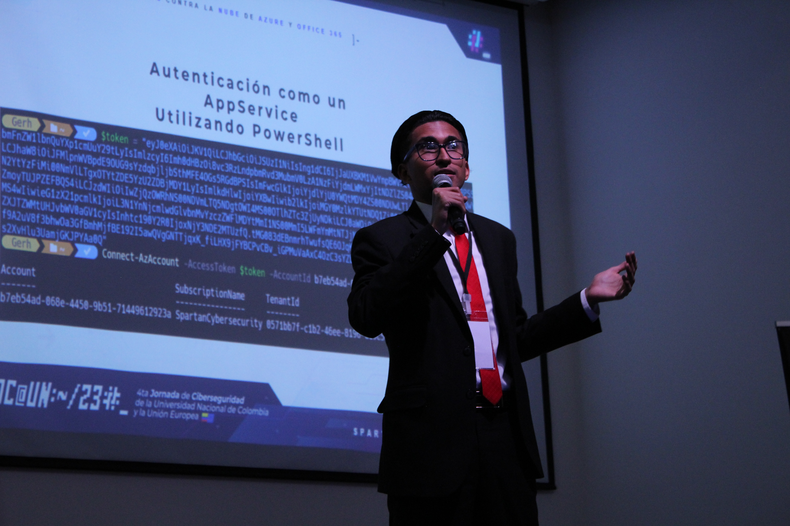

# Conoce a tu instructor

## <mark style="color:red;">Mi Nombre es Gerardo Eliasib</mark> 😎

Soy un experto en ciberseguridad y hacking ético reconocido por mi amplia trayectoria en el desarrollo de auditorias sobre proyectos críticos para entidades gubernamentales y el sector financiero. Mi experiencia está respaldada por una sólida base académica y profesional, acreditada por 8 certificaciones destacadas en el campo: OSEP, OSCP, EWPTX, CRTE, CARTP, EMAPT, CARTS, GCP-PCA y AZ-500.&#x20;

<figure><figcaption>
Evento en la universidad nacional de colombia
</figcaption></figure>

Actualmente lidero como CEO y Fundador en Spartan-Cybersecurity, una iniciativa que se ha consolidado como una fuente confiable de contenido especializado en ciberseguridad y ethical hacking. En este rol, he tenido la distinción de ser patrocinado por Amazon Web Services a través del prestigioso programa AWS Community Builder, en la categoría de ciberseguridad.&#x20;

Mi reputación en la industria también se refleja a través de mi participación como ponente en más de 5 eventos de renombre en Colombia y Panamá, donde he tenido el honor de compartir insights y estrategias con otros profesionales del campo. Además, soy el creador detrás de “TechPot”, una máquina innovadora diseñada exclusivamente para Dedicated Labs de HackTheBox.

[Sigueme para mas contenido de alta calidad.](https://linktr.ee/GerardoEliasibRH)
