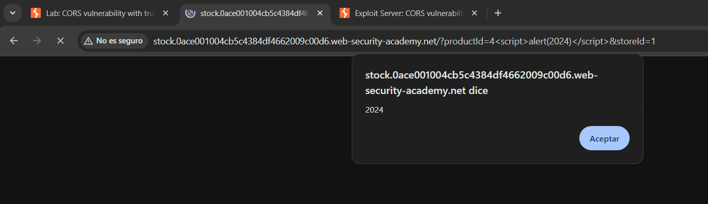

# Utilizando DOM Invader

Primero inicializamos el navegador:

<figure><figcaption></figcaption></figure>

Luego habilitamos el DOM Invader:

<figure><figcaption></figcaption></figure>

Y tambien habilitamos esta opcion:

<figure><figcaption></figcaption></figure>

Luego de lo anterior, podemos apreciar lo siguiente en el devtools:

<figure><figcaption></figcaption></figure>

Luego clickeamos en scan for gadgets:

<figure><figcaption></figcaption></figure>

Y luego abrimos el devtools y le damos en exploit:

<figure><figcaption></figcaption></figure>

Luego de lo anterior, obtendremos nuestra ejecuccion de codigo js:

<figure><figcaption></figcaption></figure>
